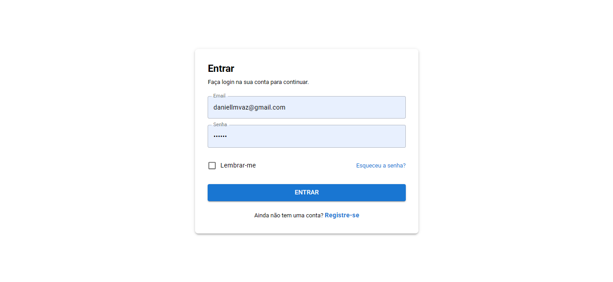
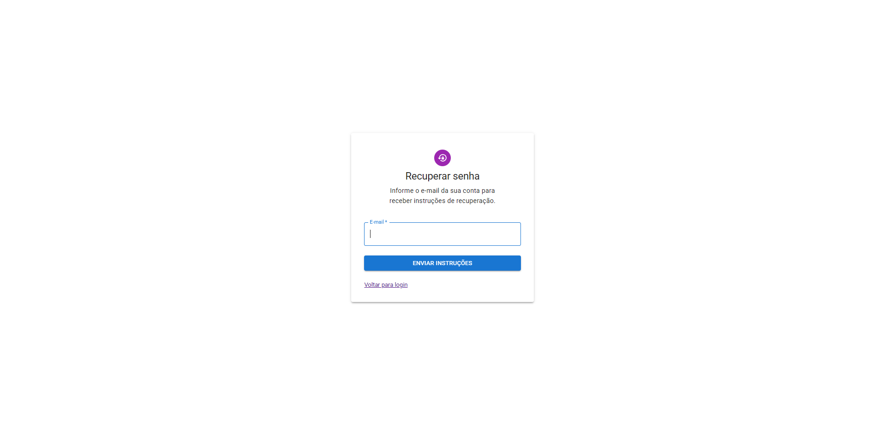
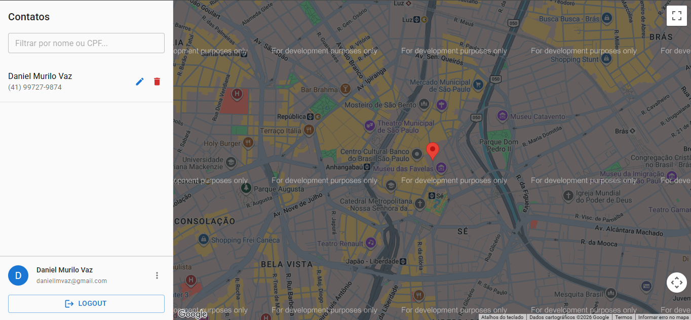
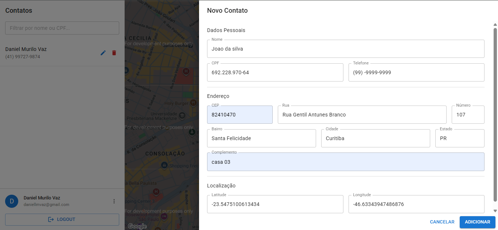
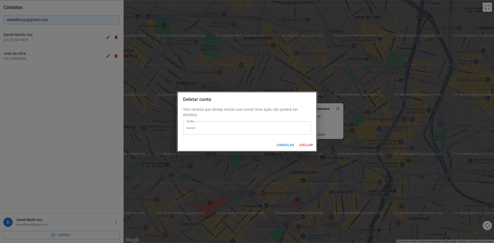

# UEX - Agenda de Contatos

Sistema de gerenciamento de contatos desenvolvido como teste técnico para a vaga de **Desenvolvedor Fullstack PHP/Laravel**.

A aplicação permite que usuários realizem cadastro, autenticação, recuperação de senha e gerenciamento completo de contatos, incluindo pesquisa de endereços, geolocalização e visualização em mapa.

---

# Objetivo do Desafio

Desenvolver uma aplicação de lista de contatos contendo:

- Cadastro e autenticação de usuários
- Recuperação de senha
- CRUD de contatos
- Pesquisa de endereços integrada ao ViaCEP
- Geolocalização utilizando Google Maps
- Visualização dos contatos em mapa
- Exclusão de conta com validação de senha
- API REST protegida por autenticação

---

# Tecnologias Utilizadas

## Backend

- PHP 8+
- Laravel 12
- Laravel Sanctum
- MySQL
- Scramble (OpenAPI)
- PHPUnit

## Frontend

- React 19
- TypeScript
- Vite
- TanStack Router
- TanStack Query
- Material UI (Material Design 3)
- React Hook Form
- Zod
- Axios

## Integrações

- ViaCEP
- Google Maps API (Geocoding + Maps)

---

# Funcionalidades Implementadas

## Autenticação

- Cadastro de usuários
- Login
- Logout
- Recuperação de senha por e-mail
- Redefinição de senha
- Proteção de rotas autenticadas com Sanctum

### Regras implementadas

- Um usuário por e-mail
- Senhas armazenadas com hash
- Endpoints protegidos por autenticação

---

## Gerenciamento de Contatos

### Cadastro

Cada contato possui:

- Nome
- CPF
- Telefone
- CEP
- Logradouro
- Número
- Complemento
- Bairro
- Cidade
- Estado
- Latitude
- Longitude

### Funcionalidades

- Criar contato
- Editar contato
- Excluir contato
- Visualizar contato
- Listar contatos

### Regras implementadas

- CPF validado através do algoritmo oficial
- CPF único por usuário
- Apenas complemento é opcional
- Validações no frontend e backend

---

## Pesquisa de Contatos

Permite pesquisa por:

- Nome
- CPF

Recursos adicionais:

- Paginação
- Ordenação
- Filtros

---

## Integração ViaCEP

A aplicação implementa um endpoint próprio no backend para consulta de endereços.

Fluxo:

1. Usuário informa critérios de busca
2. Backend consulta ViaCEP
3. Resultados são retornados ao frontend
4. Endereço selecionado preenche automaticamente o formulário

---

## Integração Google Maps

Durante o cadastro de um contato:

1. O endereço é enviado para o serviço de Geocoding
2. Latitude e longitude são obtidas automaticamente
3. Coordenadas são armazenadas no banco de dados

Na listagem:

- Os contatos são exibidos em mapa
- Ao selecionar um contato o mapa centraliza automaticamente
- Um marcador (pin) é exibido na localização correspondente

---

## Exclusão de Conta

O usuário pode excluir sua própria conta.

### Regras implementadas

- Necessário informar a senha atual
- Senha inválida impede a exclusão
- Todos os contatos vinculados são removidos automaticamente

---

# Arquitetura do Projeto

## Backend (`api/`)

```text
app/
├── Http/
│   ├── Controllers
│   ├── Requests
│   └── Middleware
├── Models
├── Services
├── Rules
└── Providers

routes/
└── api.php

database/
├── migrations
├── factories
└── seeders
```

### Responsabilidades

- Autenticação
- Regras de negócio
- Integrações externas
- Persistência de dados
- Documentação OpenAPI

---

## Frontend (`web/`)

```text
src/
├── components
├── pages
├── routes
├── contexts
├── hooks
├── services
├── http
│   └── generated
└── validations
```

### Responsabilidades

- Interface do usuário
- Gerenciamento de estado
- Consumo da API
- Validação de formulários
- Visualização dos mapas

---

# Documentação da API

A API possui documentação OpenAPI gerada automaticamente.

Após iniciar o backend:

```text
/docs/api
```

Também é gerado o arquivo:

```text
api/api.json
```

Utilizado para geração automática do cliente HTTP do frontend.

---

# Como Executar

## Banco de Dados

```bash
cd docker
docker compose up -d
```

Configuração padrão:

| Configuração | Valor   |
| ------------ | ------- |
| Banco        | MySQL 8 |
| Porta        | 3306    |
| Usuário      | root    |
| Senha        | 123456  |

---

## Backend

```bash
cd api

composer install

cp .env.example .env

php artisan key:generate

php artisan migrate

php artisan serve
```

Servidor:

```text
http://localhost:8000
```

---

## Frontend

```bash
cd web

npm install

npm run dev
```

Servidor:

```text
http://localhost:5173
```

---

# Capturas de Tela

## Login



## Esqueci minha senha



## Reset da senha


## Dashboard



## Cadastro de Contato



## Exclusão da Conta



---

# Testes

Para executar os testes do backend:

```bash
php artisan test
```

Os testes cobrem:

- Autenticação
- Cadastro de usuários
- CRUD de contatos
- Validações
- Regras de negócio
- Autorização

---

# Diferenciais Implementados

- Arquitetura organizada por responsabilidades
- Documentação OpenAPI automática
- Cliente HTTP gerado automaticamente
- Validação frontend + backend
- Integração com ViaCEP
- Integração com Google Maps
- Material Design 3
- TypeScript em toda a aplicação
- API REST documentada
- Autenticação baseada em Laravel Sanctum

---

# Autor

Desenvolvido por Daniel Murilo como parte do processo seletivo para Desenvolvedor Fullstack PHP/Laravel.
